# Screenshots

Captured from a local instance running **2.1.0**, seeded with demo data — a
fictional customer, "Northwind Energy", with two assessments six months apart.
No real assessment data appears here.

Regenerate them with `python scripts/capture_screenshots.py` (see
[`../../scripts/capture_screenshots.py`](../../scripts/capture_screenshots.py)
for the options) so a release can refresh the gallery instead of leaving
screenshots that show counts and scores the software no longer produces.

## English interface

| | |
| --- | --- |
| **Sign in** — SOC-CMM® attribution is shown on every page, including the public ones. 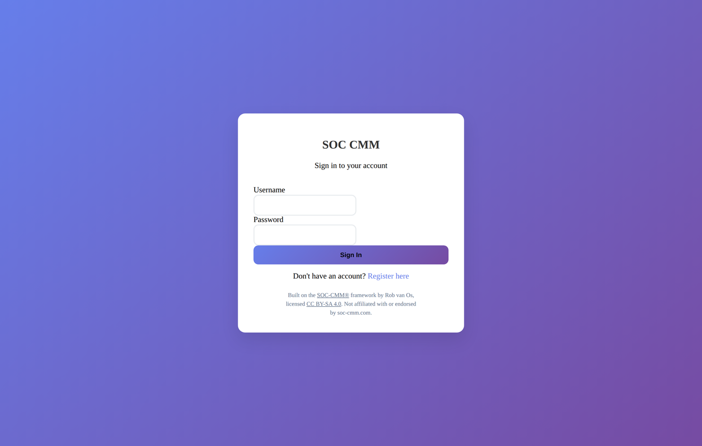 | **Register** 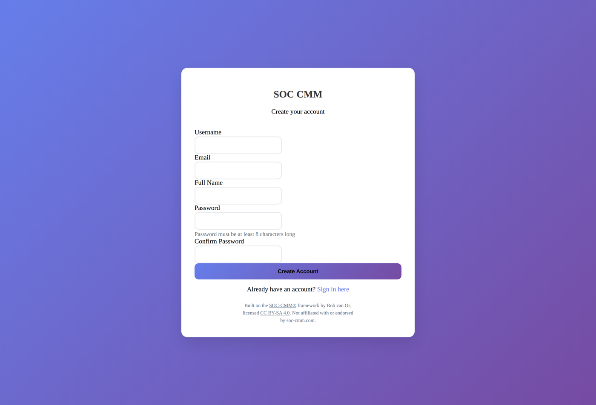 |
| **Dashboard** — assessment overview for the signed-in user. 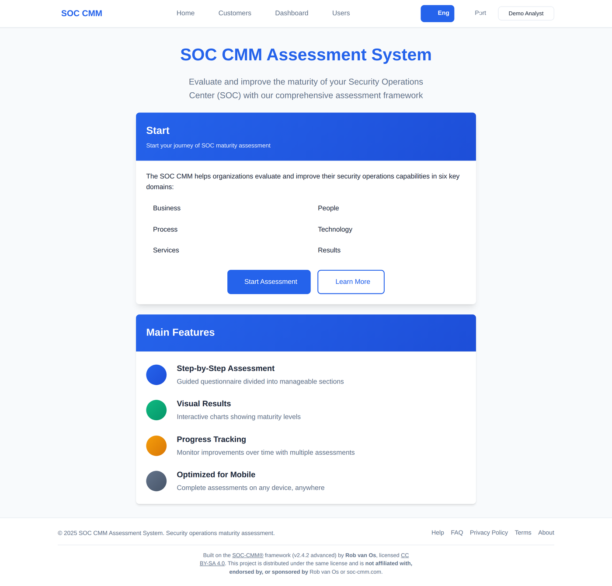 | **Customers** — multiple client organisations, scoped per user. 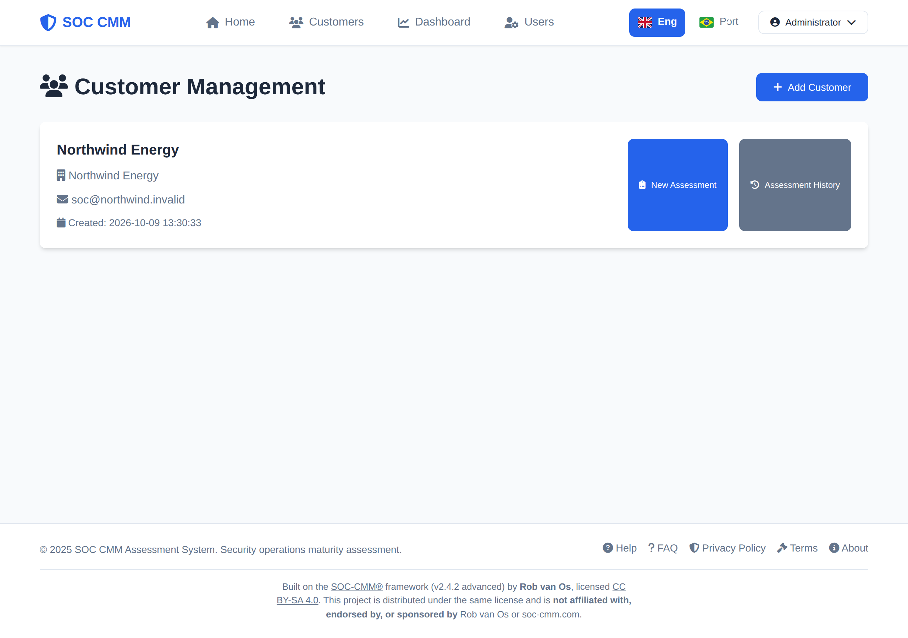 |

### Guided questionnaire
Step-by-step through the five SOC-CMM® domains and their 27 aspects — 649
questions in all. Each question carries the workbook's own guidance, and each
of its five maturity levels is worded for that specific question rather than
with a generic label.

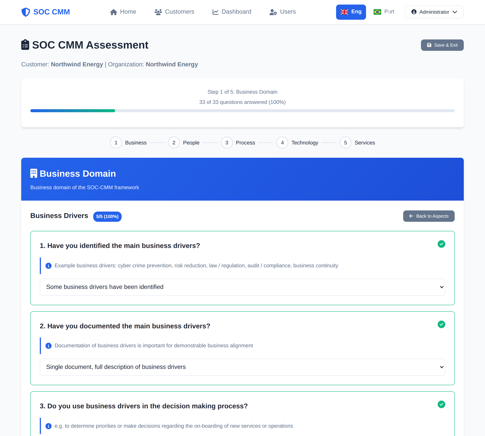

### Results
Radar chart across the five scored domains. Scores follow the official
SOC-CMM® formula, so the lowest answer reads 0% rather than a fifth of the
scale.

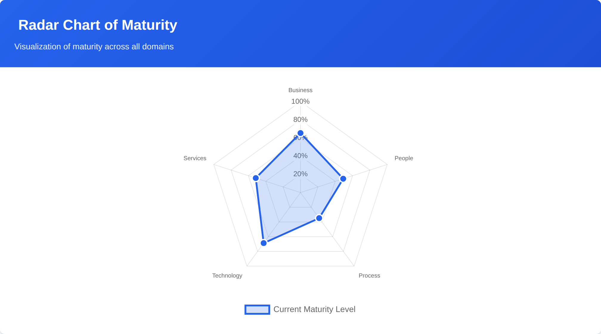

Overall maturity gauge above the radar, with the per-domain and per-aspect
breakdown and progress over time further down the page.

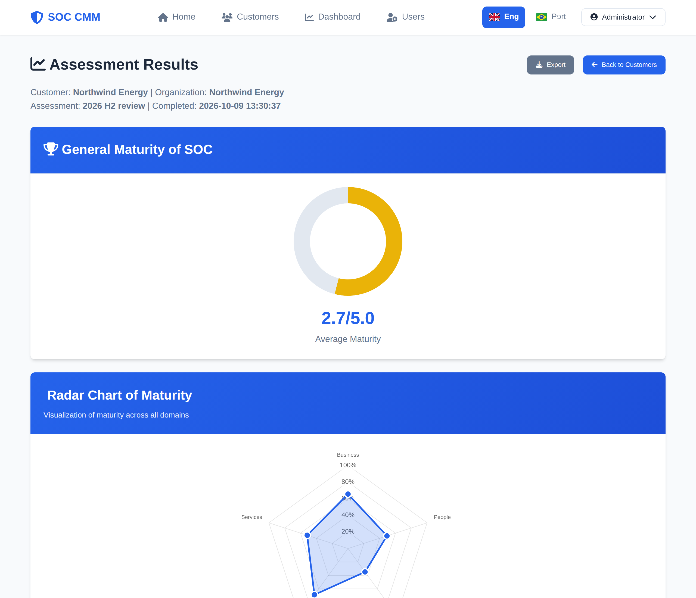

### Attribution
The About page carries the full SOC-CMM® attribution, license and
non-affiliation notice.

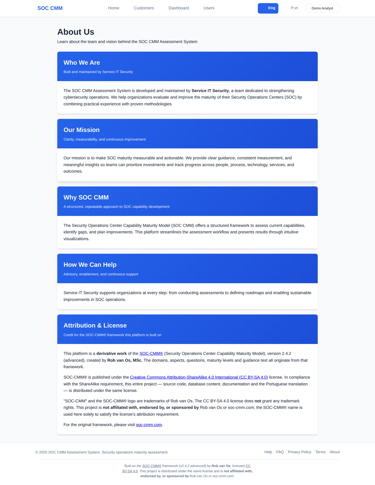

### Administration

| | |
| --- | --- |
| 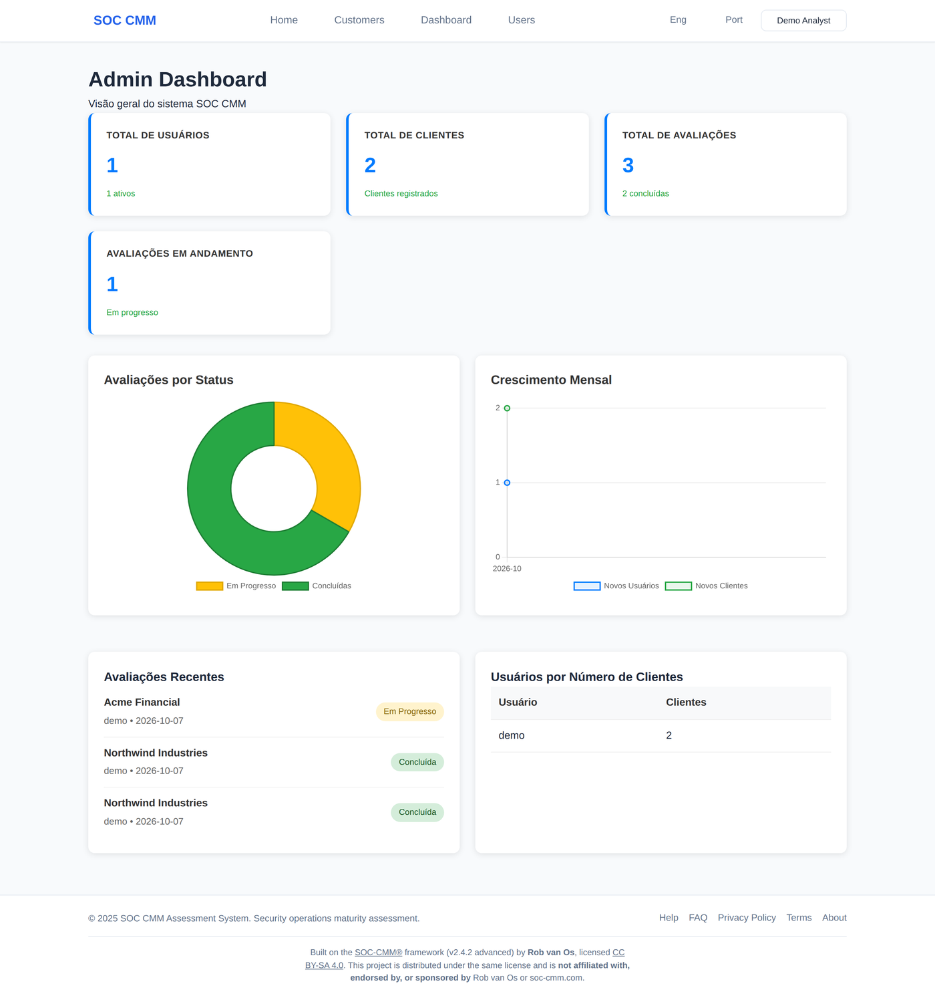 | 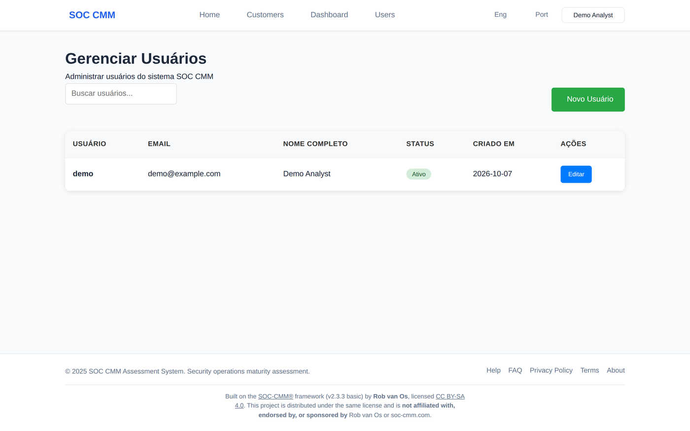 |

## Portuguese (PT-BR) interface

Not only the interface: all 649 questions, their guidance and all 3245 answer
options are translated, so the assessment itself is in Portuguese. Most of that
is machine-translated and unreviewed — see
[help wanted: review the Brazilian Portuguese translation](https://github.com/fernando-karl/soc_cmm_system/issues/22).

| | |
| --- | --- |
| 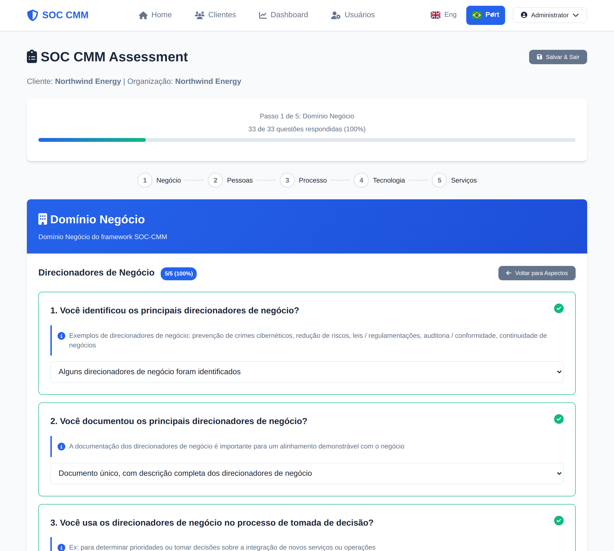 | 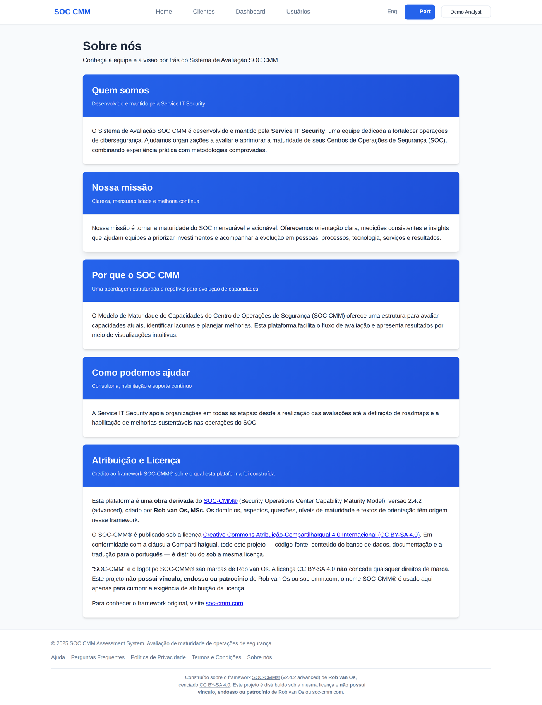 |

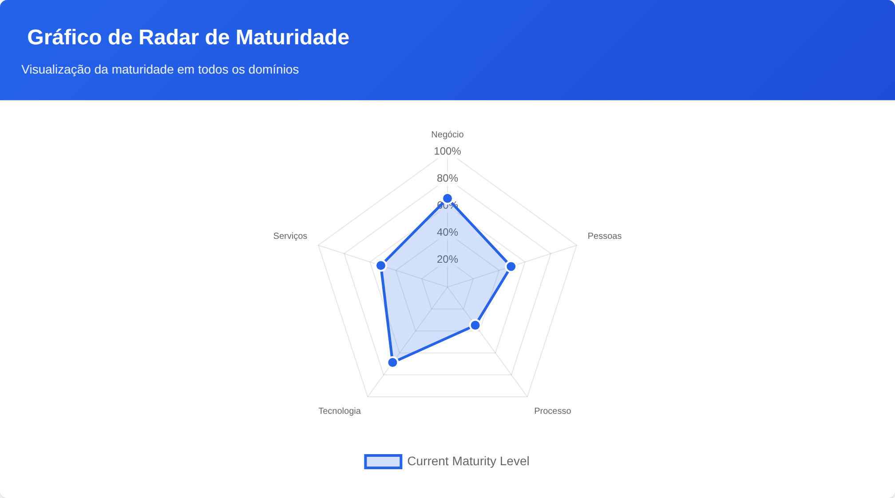

## Mobile

| | |
| --- | --- |
| 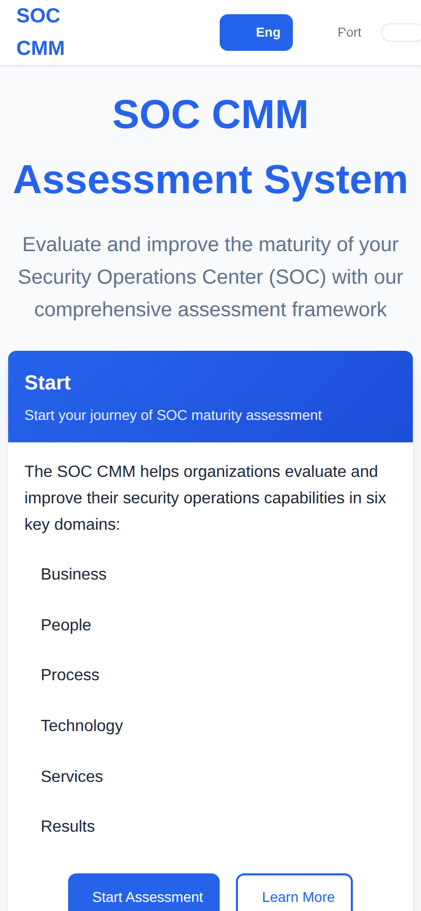 | 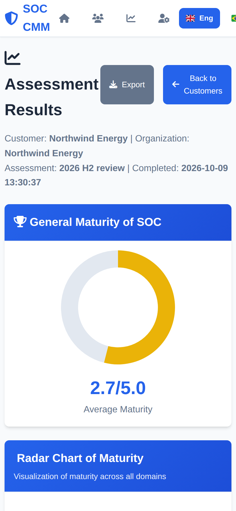 |

---

Built on the [SOC-CMM®](https://www.soc-cmm.com) framework by Rob van Os,
licensed [CC BY-SA 4.0](https://creativecommons.org/licenses/by-sa/4.0/).
Not affiliated with or endorsed by soc-cmm.com. See [`../../NOTICE`](../../NOTICE).
